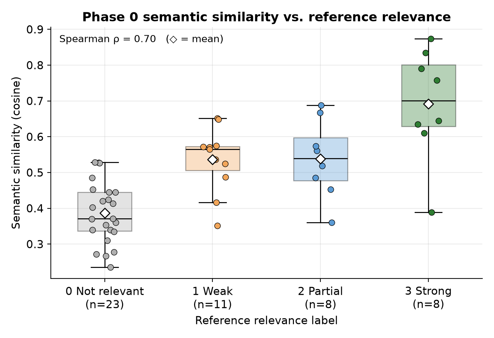
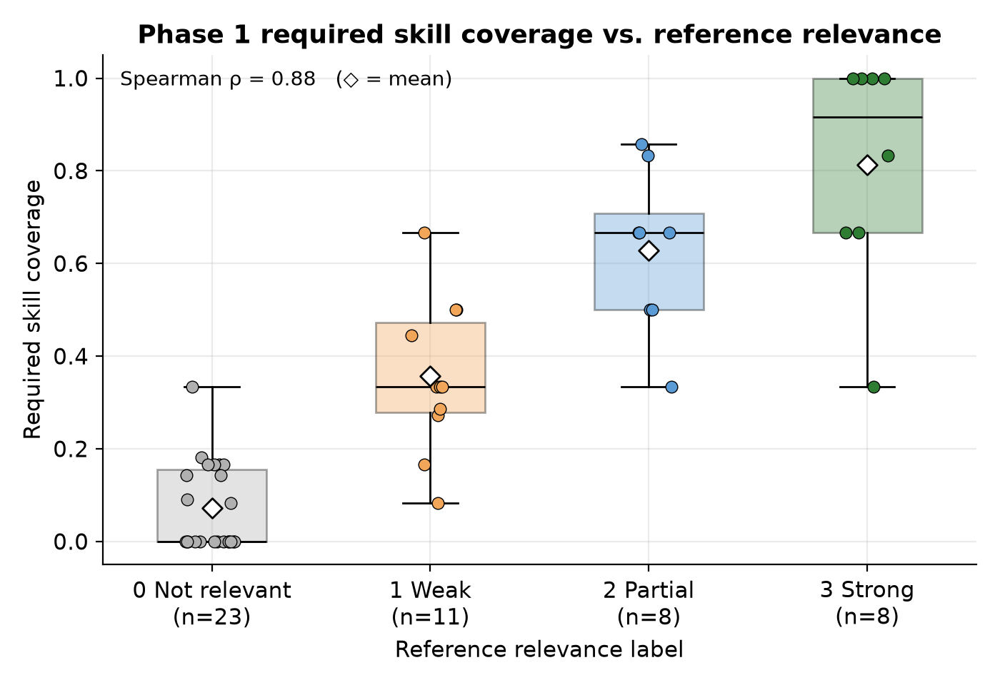
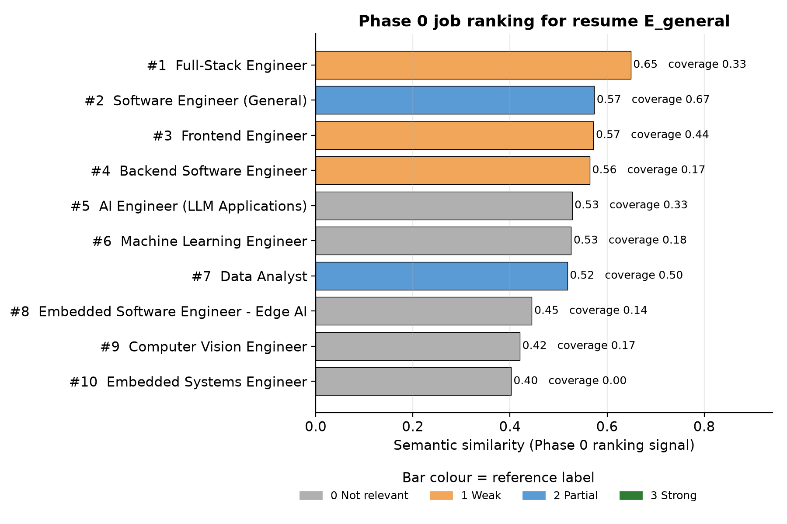
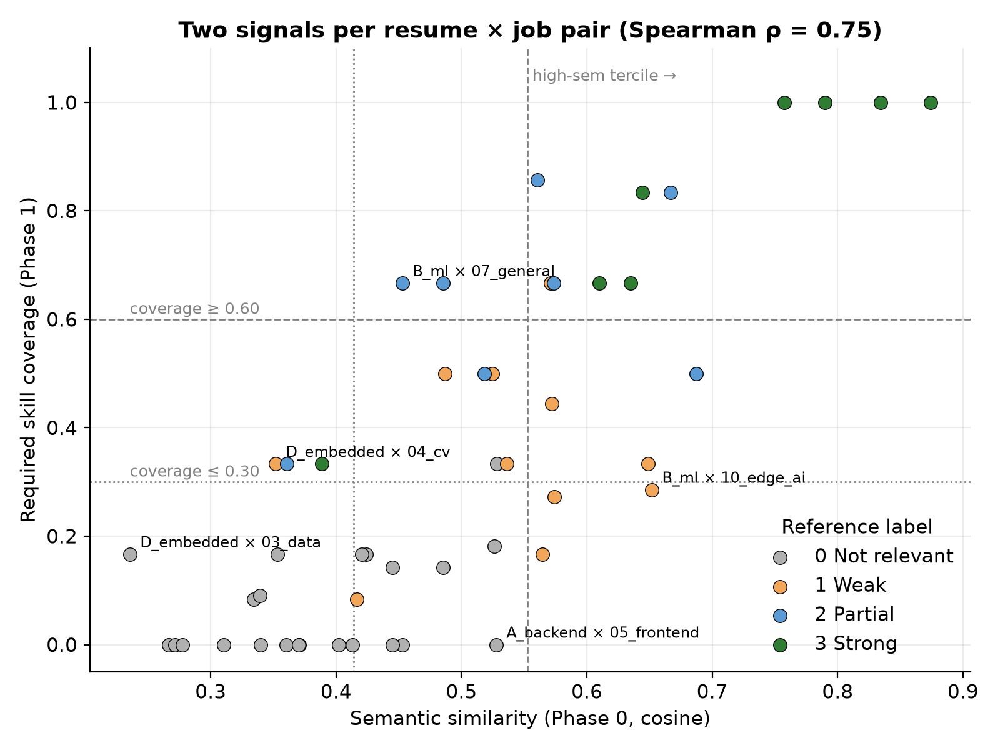
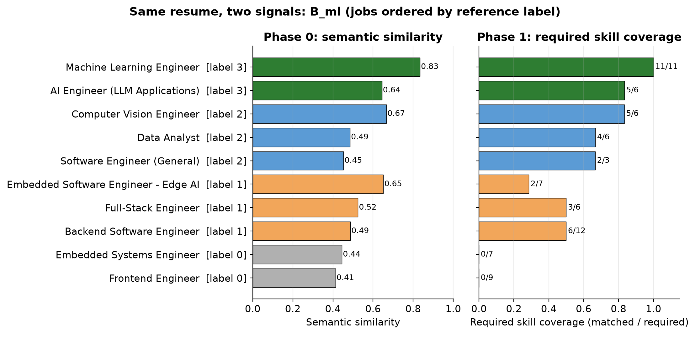

# Phase 1 Validation

## Objective

Determine whether explicit skill matching (Phase 1) provides useful information beyond the existing semantic-similarity baseline (Phase 0).

Two **independent** signals are computed for every resume × job pair and compared against manual reference relevance labels:

| Signal | Source | Definition |
|---|---|---|
| Semantic similarity | Phase 0 | Cosine similarity of all-MiniLM-L6-v2 embeddings of the full resume text and full job text |
| Required skill coverage | Phase 1 | `matched required skills / total required skills`, using the ontology-based extractor on the resume and manually labelled required skills for the job |

The signals are **not combined** into a single score. This is an engineering validation on a small controlled dataset, not a statistically definitive study.

## Experimental Setup

- Script: `experiments/run_phase1_validation.py` (deterministic; re-running reproduces every number below).
- Phase 0 code (`embeddings.py`, `similarity.py`) and Phase 1 code (`skill_extractor.py`, `skill_matcher.py`) are called unmodified.
- Semantic similarity: `embed_texts` + `compute_cosine_similarity`, the same calculation `rank_jobs` performs.
- Skill coverage: `extract_skills(resume_text)` → `match_skills(resume_skills, required_skills)`.
- Outputs:
  - `experiments/results/phase1_validation.csv`: one row per pair.
  - `experiments/results/phase1_metrics.json`: all metrics, per-resume ranking scores and the members of each disagreement category.
  - `experiments/results/phase1_resume_skills.json`: skills extracted from each resume.
  - `experiments/results/plots/*.png`: the figures.

### Dataset

| | Count | Source |
|---|---|---|
| Resumes | 5 | Pre-existing `experiments/data/resumes/` (unchanged) |
| Job descriptions | 10 | 7 pre-existing + 3 created for this experiment |
| Resume × job pairs | **50** | Full cross product |

Resume profiles:

| ID | Profile |
|---|---|
| A_backend | Senior backend (Python/Go, Kafka, K8s, AWS) |
| B_ml | ML/data-science engineer (PyTorch, NLP + CV, MLOps, RAG) |
| C_frontend | Frontend / full-stack (React, TypeScript, Node.js) |
| D_embedded | Embedded firmware (C/C++, FreeRTOS, ARM) |
| E_general | Junior generalist (basic Python/JS/Flask/Pandas) |

Jobs:

| ID | Title |
|---|---|
| 01 | Backend Software Engineer |
| 02 | Machine Learning Engineer |
| 03 | Data Analyst |
| 04 | Computer Vision Engineer |
| 05 | Frontend Engineer |
| 06 | Embedded Systems Engineer |
| 07 | Software Engineer (General) |
| 08 | Full-Stack Engineer (*new*) |
| 09 | AI Engineer, LLM Applications (*new*) |
| 10 | Embedded Software Engineer, Edge AI (*new*) |

The three new jobs fill the Full-Stack and AI Engineer roles that were missing. They were written to sit *between* existing profiles (Full-Stack spans A and C, AI Engineer spans A and B, Edge AI spans B and D), so they produce non-obvious matches.

**Note on designed pairs.** In the pre-existing data, four resumes list the hiring company of one job as their current employer (A↔01 CloudScale, B↔02 DeepTech, C↔05 Nova Studios, D↔06 IoTech). These are deliberately obvious matches. The metrics are therefore also reported with those 4 pairs excluded.

### Ground Truth Methodology

**Structured requirements** (`experiments/data/job_requirements.json`):

- `required_skills` were labelled manually from each job's *Requirements* section only. Only these contribute to coverage.
- `preferred_skills` come from *Nice to have* or responsibilities. They are recorded but **not** scored.
- **Any-of groups:** a requirement such as "Python or Go" or "PyTorch or TensorFlow" is a nested list. It counts as one required skill and is satisfied if the resume has any member. Because the Phase 1 matcher has no OR semantics, each group is resolved in the experiment script before calling `match_skills`. The group becomes the member the resume has, or else a label such as `"PyTorch or TensorFlow"` that is reported as missing. The matcher itself is unchanged.
- **Unmodelled requirements:** required items that are not in the 100-skill ontology (e.g. "SPI/I2C", "WCAG", "vector search") are listed under `unmodelled_required` and are not scored. Every scored skill name was checked against the ontology at load time.
- No automatic required/preferred section parsing was implemented.

**Reference relevance labels** (`experiments/data/ground_truth.csv`):

- One label per pair: 0 = not relevant, 1 = weak, 2 = partial, 3 = strong, each with a one-line reason.
- Labels were written by reading the resume and job description, **before** either system was run on the new dataset, and were not revised afterwards.
- Label distribution: 23 × 0, 11 × 1, 8 × 2, 8 × 3.

> **Important caveat (circularity).** The same annotator (the assistant, acting as reference labeller) wrote both the required-skill lists and the relevance labels, and most label reasons are phrased in terms of skills. Agreement between skill coverage and the labels is therefore partly expected by construction. Independent human labels are required before drawing strong conclusions. See [Limitations](#limitations).

### Disagreement category definitions

Cosine similarity has no absolute scale, so semantic bands use the dataset's terciles. Coverage is a proportion, so it uses fixed bands.

- Semantic similarity:
  - low: below 0.414 (33rd percentile)
  - moderate: 0.414 to 0.553
  - high: 0.553 or above (67th percentile)
- Coverage:
  - low: 0.30 or below
  - high: 0.60 or above

## Results

### Semantic Similarity Performance

| Reference label | n | Mean semantic similarity (± sd) |
|---|---|---|
| 0 Not relevant | 23 | 0.387 ± 0.086 |
| 1 Weak | 11 | 0.536 ± 0.090 |
| 2 Partial | 8 | 0.538 ± 0.109 |
| 3 Strong | 8 | 0.692 ± 0.157 |

- Spearman ρ (semantic vs label) = **0.70** (bootstrap 95% CI 0.51 to 0.83).
- Semantic similarity separates "not relevant" from the rest, and "strong" from the rest.
- It does **not** separate *weak* from *partial*: the means are 0.536 and 0.538.
- The label-0 distribution overlaps the label-1/2 range. For example, A_backend × Frontend has semantic similarity 0.53 and label 0.

### Skill Coverage Performance

| Reference label | n | Mean required skill coverage (± sd) |
|---|---|---|
| 0 Not relevant | 23 | 0.071 ± 0.094 |
| 1 Weak | 11 | 0.356 ± 0.164 |
| 2 Partial | 8 | 0.628 ± 0.177 |
| 3 Strong | 8 | 0.813 ± 0.243 |

- Spearman ρ (coverage vs label) = **0.88** (bootstrap 95% CI 0.80 to 0.93).
- Mean coverage rises at every step of the label scale.
- The spread within label 3 is wide (0.33 to 1.00); see the failure cases below.

### Correlation summary

| Metric | Semantic similarity | Required skill coverage |
|---|---|---|
| Spearman ρ vs label, all 50 pairs | 0.70 | 0.88 |
| Spearman ρ vs label, excluding 4 designed pairs (n = 46) | 0.62 | 0.85 |
| Mean within-resume Spearman ρ (10 jobs per resume) | 0.78 | 0.90 |
| ROC AUC, label ≥ 2 vs ≤ 1 | 0.82 | 0.97 |

The two signals correlate with each other at ρ = 0.75 (0.68 excluding designed pairs). They are related but far from redundant.

p-values are in `phase1_metrics.json` but are **not** meaningful as significance tests here. The 50 pairs are not independent: every resume appears 10 times and every job 5 times. The bootstrap intervals resample pairs and are therefore too narrow.

### Ranking performance

Each resume ranks the 10 jobs by one signal. NDCG uses the reference labels as gains.

| Metric (mean over 5 resumes) | Semantic | Coverage | Random ranking (expected) |
|---|---|---|---|
| NDCG@3 | 0.873 | 0.967 | 0.401 |
| NDCG@10 | 0.949 | 0.988 | 0.699 |
| Top-1 job has the resume's best label | 4 / 5 | 5 / 5 | — |

Per resume, NDCG@3:

| Resume | Semantic | Coverage |
|---|---|---|
| A_backend | **0.98** | 0.89 |
| B_ml | 0.81 | **0.99** |
| C_frontend | 0.84 | **1.00** |
| D_embedded | **1.00** | 0.95 |
| E_general | 0.73 | **1.00** |

Semantic similarity ranks better for two resumes (A and D), so coverage is not uniformly better.

**Ranking example: E_general (junior generalist).** Phase 0 ranks Full-Stack Engineer first (semantic similarity 0.65, label 1). The Data Analyst role, which is one of E's two best matches (label 2), comes 7th. On the 384-dimensional embedding, E's broad web/data vocabulary looks similar to almost every job: 7 of 10 jobs fall between 0.51 and 0.65. Coverage ranks Software Engineer (General) (0.67) and Data Analyst (0.50) as the top two.

### Disagreement Analysis

#### Case A: high semantic similarity + low skill coverage (3 pairs)

| Pair | Semantic | Coverage | Label | Missing required skills |
|---|---|---|---|---|
| B_ml × Edge AI (10) | 0.652 | 2/7 = 0.29 | 1 | C, C++, Embedded Systems, Linux, ARM |
| A_backend × ML Engineer (02) | 0.574 | 3/11 = 0.27 | 1 | Machine Learning, PyTorch/TF, NLP/CV, MLflow, Pandas, Spark, Airflow, A/B Testing |
| E_general × Backend (01) | 0.564 | 2/12 = 0.17 | 1 | REST APIs, gRPC, PostgreSQL, Redis, Kafka/RabbitMQ, Docker, Kubernetes, … |

Why semantic similarity misleads here:

- **B × Edge AI.** The job and the resume share a topic vocabulary: computer vision, models, inference, latency, edge deployment, optimisation. The embedding captures *what the documents are about*, not *what the candidate can do*. The job's core requirement, embedded C/C++ on ARM Linux, is entirely absent from the resume. Phase 0 ranks this job 3rd for B, above two label-2 jobs. Coverage puts it last among B's non-zero-coverage jobs (8th).
- **A × ML Engineer.** Both documents describe production pipelines, Docker/Kubernetes, monitoring and latency. The infrastructure overlap is real, but the ML-modelling core is missing, and the missing-skill list makes that visible immediately.
- **E × Backend.** E's resume is generic "software developer / Python / APIs / deploy" text, which is moderately similar to every software job.

Near the boundary are two more pairs:

- **E × Full-Stack:** semantic similarity 0.649 (E's top-ranked job), coverage 0.33, label 1.
- **A × Frontend:** semantic similarity 0.528, coverage 0/9, label 0. A backend engineer with no frontend skills scores higher on semantic similarity than 4 of the 8 label-2 pairs.

#### Case B: moderate semantic similarity + high skill coverage (2 pairs)

| Pair | Semantic | Coverage | Label | Missing |
|---|---|---|---|---|
| B_ml × Data Analyst (03) | 0.485 | 4/6 = 0.67 | 2 | Tableau/Power BI/Looker, Data Visualization |
| B_ml × Software Engineer General (07) | 0.453 | 2/3 = 0.67 | 2 | Data Structures and Algorithms |

Explicit skills recover useful information here. Phase 0 places both of these label-2 jobs *below* three label-1 jobs: B × Edge AI (0.652), B × Full-Stack (0.525) and B × Backend (0.487). The text styles differ: a research-heavy ML resume versus a business-analytics JD or a generic SWE JD. The required skills (SQL, Python, Pandas, NumPy; a listed language plus Git) are nonetheless genuinely present.

No pairs fell into *low semantic + high coverage*.

### Strong Matches

#### Case C: high semantic similarity + high skill coverage (11 pairs)

The four designed pairs score at the top of both signals:

| Pair | Semantic | Coverage | Label |
|---|---|---|---|
| A_backend × Backend | 0.874 | 12/12 | 3 |
| B_ml × ML Engineer | 0.834 | 11/11 | 3 |
| C_frontend × Frontend | 0.790 | 9/9 | 3 |
| D_embedded × Embedded | 0.758 | 7/7 | 3 |

Two non-designed strong matches also agree:

| Pair | Semantic | Coverage | Label | Note |
|---|---|---|---|---|
| B_ml × AI Engineer | 0.644 | 5/6 | 3 | Only "LLMs" missing, which is an extraction gap (see below) |
| C_frontend × Full-Stack | 0.635 | 4/6 | 3 | Missing PostgreSQL (genuine) and Git (extraction artefact) |

Case C also contains three label-2 pairs (B × CV, D × Edge AI, E × General) and one label-1 pair (A × AI Engineer). Both signals over-rate the label-1 pair; it is discussed under Failure Cases.

#### Case D: low semantic similarity + low skill coverage (14 pairs)

All 14 pairs are labelled 0. Examples:

| Pair | Semantic | Coverage |
|---|---|---|
| C_frontend × CV Engineer | 0.267 | 0/6 |
| D_embedded × Frontend | 0.272 | 0/9 |
| D_embedded × Data Analyst | 0.235 | 1/6 |

When both signals are low, the result was always correct in this dataset.

### Failure Cases

These are pairs where one or both signals disagree with the reference label.

1. **C_frontend × Software Engineer (General). Both signals low, label 3.**
   - Semantic similarity is 0.388, because the JD is generic and C's resume is frontend-specific.
   - Coverage is 1/3, for two reasons:
     - "Data Structures and Algorithms" is required, but **no** resume mentions it, which caps coverage for job 07 at 2/3 for everyone.
     - "Git" is missed because C's only mention is "GitHub Actions". The longest-match rule assigns that span to *GitHub Actions*, so the shorter *Git* alias inside it is not also reported.

   Lesson: implicit skills and longest-match masking cause false negatives.
2. **A_backend × AI Engineer. Coverage 4/6 = 0.67, label 1.**
   - Coverage weights every required skill equally.
   - Python, FastAPI, Docker and Git are matched. These are generic service skills that most backend engineers have.
   - The two skills that define the role (LLMs, RAG) are missing.

   Lesson: unweighted coverage over-rates candidates who hold the commodity skills but not the core ones.
3. **B_ml × AI Engineer. "LLMs" reported missing.**
   - B's resume lists GPT, T5, LangChain and RAG but never the words "LLM" or "large language model".
   - The ontology has no "GPT" alias for LLMs.

   Lesson: coverage is only as good as the ontology vocabulary.
4. **E_general × Frontend. Coverage 4/9 = 0.44 from "React (basic tutorials, limited experience)".**
   - The extractor records skill *presence*, not proficiency or depth, so tutorial-level React counts the same as 5 years of expert React.
5. **D_embedded × Software Engineer (General). Semantic 0.361, coverage 1/3, label 2.**
   - The language group is satisfied (D has Python). The two misses are "Data Structures and Algorithms", which no resume mentions, and Git, which D's resume never mentions.
   - Coverage is penalised for absent text evidence of skills an experienced engineer almost certainly has.
6. **Semantic outliers.** The two lowest-similarity label-3 and label-2 pairs (C × General 0.388, D × General 0.361) both involve the generic job 07. Short, generic JDs embed poorly against detailed resumes.

## What Phase 1 Adds Over Phase 0

1. **An explainable gap list.**
   - Every pair has explicit matched and missing required skills, e.g. *B × Edge AI: missing C, C++, Embedded Systems, Linux, ARM*.
   - Phase 0 produces a single opaque number.
2. **Discrimination where semantic similarity is flat.**
   - Semantic similarity does not separate weak (1) from partial (2) matches (means 0.536 vs 0.538). Coverage does (0.356 vs 0.628).
   - It also distinguishes jobs that a generalist resume embeds almost equally close to (resume E).
3. **Detection of topic-similar but skill-mismatched jobs (Case A),** where shared domain vocabulary inflates semantic similarity.
4. **Recovery of skill-matched jobs written in a different style (Case B).**
5. **Robustness to document length.**
   - all-MiniLM-L6-v2 truncates input at **256 word-pieces**. The resumes are 447 to 750 word-pieces, so Phase 0 embeds only the first 34–57% of each resume. The technical-skills section is usually near the top, but most of the experience section is never seen.
   - Seven of the ten JDs also exceed the limit, which typically cuts off the "Nice to have" section.
   - The skill extractor reads the full text.

Phase 0 still contributes information that coverage lacks. It ranked better than coverage for resumes A and D. It is not affected by ontology gaps or by any-of labelling choices. It captures domain context that a flat skill list cannot express, such as "production", "research" or "seniority". The two signals are correlated (ρ = 0.75) but disagree in informative ways. **They provide complementary information.**

## Limitations

- **Circular labelling (most important).**
  - One annotator wrote the required-skill lists and the relevance labels, and the labels are largely skill-based.
  - Coverage's higher correlation (0.88 vs 0.70) is likely inflated by this, so it should not be read as evidence that coverage is a better relevance measure.
  - Independent labels from multiple human annotators, with inter-annotator agreement measured, are needed.
- **Small, synthetic, clean dataset.**
  - 5 resumes, 10 jobs. Resumes have tidy "Technical Skills" sections, which favours dictionary extraction.
  - Real resumes (scanned PDFs, tables, unusual phrasing) would lower extraction recall.
- **Designed pairs.** Four pre-existing pairs are obvious one-to-one matches. Excluding them lowers both correlations (0.62 and 0.85) and leaves their ordering unchanged.
- **Non-independent pairs.** p-values and bootstrap CIs overstate certainty. No significance claims are made.
- **Manual required-skill labels.**
  - In the deployed Phase 1 pipeline (`match_resume_to_job`), every skill found in a JD is treated as required, and there are no any-of groups.
  - This experiment therefore measures coverage under *ideal* requirement labelling, which is an upper bound for the current automated pipeline.
- **Ontology coverage.**
  - Unmodelled requirements (protocols, accessibility, vector search, etc.) are ignored.
  - Missing aliases (e.g. GPT → LLMs) create false "missing" skills.
- **Presence, not proficiency.** Coverage cannot tell "basic tutorials" from "expert, 5 years".
- **Equal weighting.** Core and commodity skills count the same.
- **Arbitrary category thresholds.** The terciles and the 0.30 / 0.60 cut-offs only affect how pairs are grouped in the disagreement analysis, not the correlations.
- **Phase 0 truncation at 256 tokens.** This was observed but not changed, because Phase 0 is frozen.

## Conclusions

1. On this controlled dataset, both signals track the reference labels:
   - semantic similarity ρ = 0.70
   - required skill coverage ρ = 0.88
   - both far above random ranking (NDCG@3 0.87 and 0.97 vs 0.40)
2. Coverage aligned more closely with these labels. Because of the labelling circularity and the small sample, this is **not** evidence that coverage is a superior relevance measure in general.
3. The signals **disagree in systematic, interpretable ways**:
   - Semantic similarity is inflated by shared topic vocabulary (Case A) and by generic resumes.
   - Coverage is distorted by vocabulary gaps, implicit skills, equal weighting and presence-only matching.
4. Phase 1's clearest, label-independent contribution is **explainability**: an explicit list of matched and missing required skills for every pair, which Phase 0 cannot produce.
5. The defensible conclusion is that the two signals are **complementary**. This supports keeping both as separate inputs. Combining them into a fit score is out of scope here.
